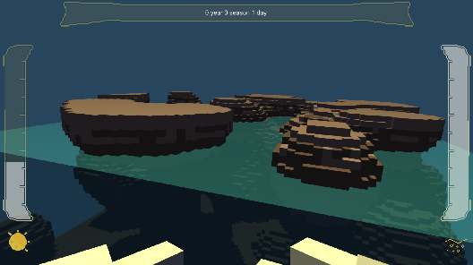

<link rel="stylesheet" href="Style.css">

## Who am I?

	I am a French IT engineer student at CESI Lille in France. I am currently in my fifth year of IT Engineering out of five.
	I spent most of my personnal time developing video games with the game engine <strong>Unity</strong>. However, my first projects were created using <strong>Game Maker Studio 2</strong> and <strong>RPG Maker VX Ace</strong>. But these engines were too restrictive for us. 

	Hopefully, I do not work alone. I created in 2017 with <a href ="https://www.linkedin.com/in/antonin-jacob-lille/">Antonin Jacob</a> (do not hesitate to check its work too <a href = "https://sheepybullet.itch.io/">sheepybullet.itch.io</a>) a video game development club called Wild Box Studio.
	Most of my works and prototypes are related to this club, even if I make some prototypes (and write some novels and role playing games) alone.

	I am making these projects as a hobbyist because game development is not a part of my IT engineering courses.

	<a href = "https://gabriel-jouet.itch.io/">Itch.io</a> |
	<a href = "https://www.linkedin.com/in/gabriel-jouet-2909aa15a/">LinkedIn</a> |
	<a href = "https://github.com/GabrielJouet">GitHub</a>

## Wild Box Studio

	Wild Box Studio is a video game development club I created with <a href ="https://www.linkedin.com/in/antonin-jacob-lille/">Antonin Jacob</a> in 2017. 
	We try making and developing games with our basic knowledge of the video game industry. 
	By combining our experiences, skills and our IT Engineering courses, we are able to create small playable prototypes as hobbyists.

	<a href = "https://github.com/Wild-Box-Studio">GitHub</a>

## My Experiences

	Like I have said before, I am an IT Engineering student at CESI in Lille currently in my fourht year out of five.
	Our school wants us to make multiple internships, so did I.
	<ul>
		<li>
			From <strong>September 2020 to January 2021</strong>, I had a position of <strong>Gameplay Programmer at Ubisoft Paris Mobile</strong> in Montreuil, France during 5 months and a half.
			I mainly worked with PHP for their API and their server-side authentification, then I reworked and improved their tracking system with Unity.
		</li>

		<li>
			From <strong>January 2020 to April 2020</strong>, I had a position of <strong>Game Developer at YS Interactive</strong> in Valenciennes, France during 3 months and a half.
			I developed several mini-games with Unity in order to test cognitive skills.
		</li>

		<li>
			From <strong>April 2019 to June 2019</strong>, I had a position of <strong>Web Developer at AREP FRESC</strong> in Roubaix, France during 3 months.
			I developped a web-based tool with Symfony 4 and managed presentations and resources management.
		</li>

		<li>
			From <strong>September 2018 to November 2018</strong>, I had a position of <strong>Symfony Developer at Cube Solution</strong> in Seclin, France during 2 months.
			I worked on a new web tool for Nord Avenir Technologies with Symfony 4.
		</li>
	</ul>

## Recent Works
### Ruins of Akate

	Ruins of Akate is a <strong>survival</strong> game with random generation elements. Your goal is to survive within a harsh environment.

	This project is still in a prototype state 

 

### Laser Run

	Laser Run is a <strong>ability challenging</strong> game. You have to stay alive in these areas by dodging waves of lasers coming at you.

	This project is still in a prototype state 

 

### Juan y Carlos

	Juan y Carlos is a <strong>cooperative puzzle game jam project</strong> made for the <a href="https://itch.io/jam/gmtk-2021">GMTK Game Jam 2021</a>. It was created under 48 hours in June 2021 with 3 of my colleagues.

	 

	I was in charge of developing enemies, building environment and level design.

	<a href = "https://sydiko.itch.io/juan-y-carlos">Itch.io page</a>  

 

### Wild Fibers

	My biggest project, so far, is a <strong>Tower Defense game</strong> where you play as plants that need to defend themselves against hungry insects. 

	 

	This project begun in May 2020 and ends in November 2021. I am working with one colleague.
	
	 

	I am in charge of development (towers, enemies, UI and more), design and additional graphics if needed.

	<a href = "https://gabriel-jouet.itch.io/wffb">Itch.io page</a>

## Archived works
### Simulation of Evolution

### Four Dungeons

	<a href = "https://sydiko.itch.io/four-dungeons">Itch.io page</a> 

### Space Destructor

	<a href = "https://gabriel-jouet.itch.io/space-destructor/">Itch.io page</a>  

### Earth's Disaster
